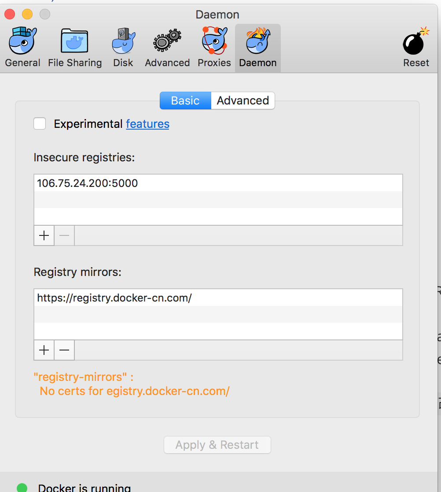
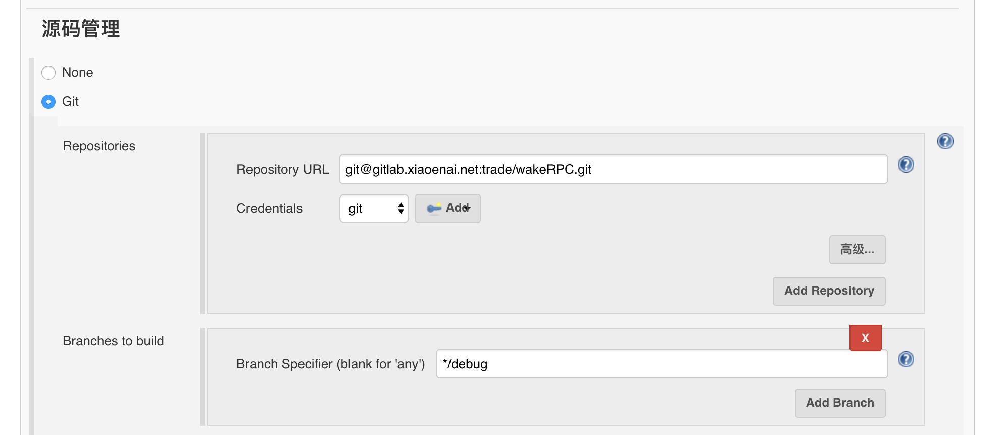
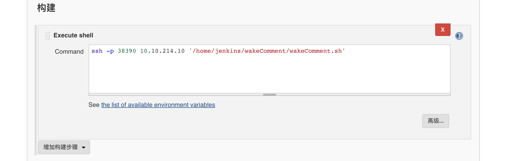
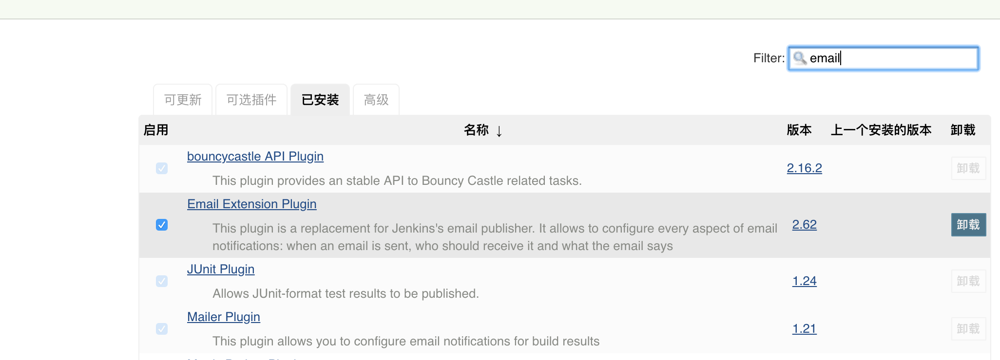
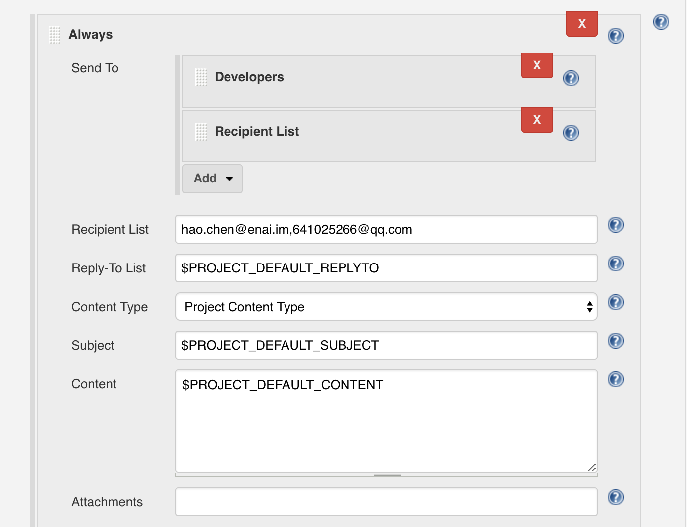
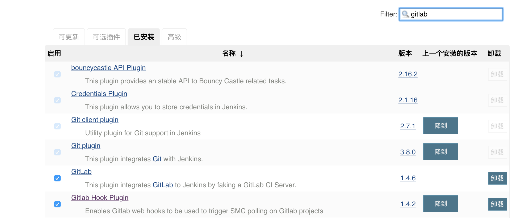
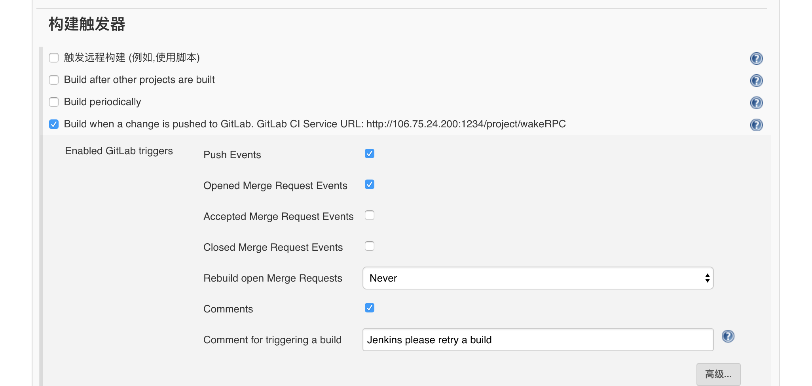
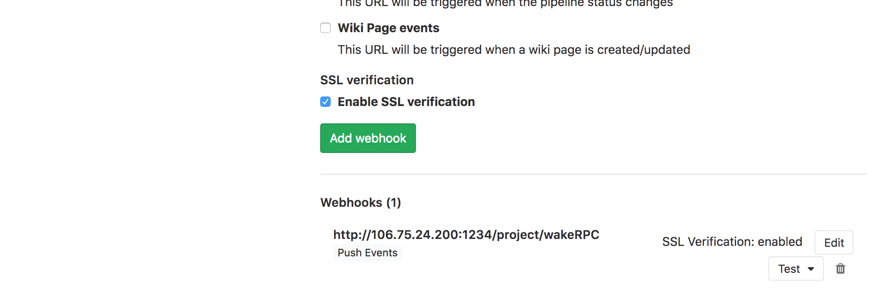

# wake新架构测试环境docker化 #

## 第一阶段##
    1. 本地mac从gitlab拉取代码，启动容器时挂载代码对应的目录，然后在容器内开发，热编译，测试。
    2. 确认代码没有问题后，本地提交
    3. 第一阶段完成后，实现开发在本地docker内开发测试。本阶段所需的代码和配置如下
```
]export GOPATH=/Users/chenhao/gobook
]echo $GOPATH
/Users/chenhao/gobook
]ll /Users/chenhao/gobook
total 0
drwxr-xr-x  3 chenhao  staff    96B  4 25 14:37 bin
drwxr-xr-x  3 chenhao  staff    96B  4 24 14:01 pkg
drwxr-xr-x  8 chenhao  staff   256B  4 24 17:34 src
]vi  wakeRPC.sh
#!/bin/bash
start() {
docker run  -d -p 2379:2379  --name etcd1   106.75.24.200:5000/quay.io/coreos/etcd:v3.2  \
       /usr/local/bin/etcd    --name node1 \
      --initial-advertise-peer-urls 'http://0.0.0.0:2380'  --listen-peer-urls 'http://0.0.0.0:2380' \
      --advertise-client-urls 'http://0.0.0.0:2379' --listen-client-urls 'http://0.0.0.0:2379' \
      --initial-cluster 'node1=http://0.0.0.0:2380'  --auto-compaction-retention=1

docker run  -d -p 3379:2379 --name etcd2   106.75.24.200:5000/quay.io/coreos/etcd:v3.2  \
       /usr/local/bin/etcd    --name node1 \
      --initial-advertise-peer-urls 'http://0.0.0.0:2380'  --listen-peer-urls 'http://0.0.0.0:2380' \
      --advertise-client-urls 'http://0.0.0.0:3379' --listen-client-urls 'http://0.0.0.0:3379' \
      --initial-cluster 'node1=http://0.0.0.0:2380'  --auto-compaction-retention=1

docker run -d -p 5000:5000 -p 5020:5020 -p 5030:5030 -v $GOPATH:/root/go --name wakeRPC    106.75.24.200:5000/centos:7.11 /root/wakeGateway.sh
}
stop() {
docker container stop etcd1 etcd2 wakeRPC  && docker container rm etcd1 etcd2 wakeRPC
}

case $1 in
     start)
      start
      ;;
     stop)
      stop
      ;;
     *)
     exit 1
      ;;
esac
]/Users/chenhao/wakeRPC.sh start  
```
### 说明###
1. 因为在我本地的GOPATH是/Users/chenhao/gobook，而且已经把wakeRPC涉及到的所有代码拉取到GOPATH里面了，所以在你本地需要做相应配置
2. 要把wakeRPC项目内的所有etcd配置做修改，比如$GOPATH/src/trade/wakeRPC/wakeComment/config/config.yaml内的etcd修改为本地容器etcd1的172.17.0.2
3. $GOPATH/src/trade/wakeGateway/config/config.yaml里面的etcd地址修改为本地容器etcd1的172.17.0.2，gray_etcd地址修改为本地容器etcd2的172.17.0.3
4. 执行/Users/chenhao/wakeRPC.sh start后，就启动了etcd1，etcd2，wakeRPC这3个容器，此时可以进入到wakeRPC容器做开发工作，wakeRPC容器默认启动了wakeGateway进程，如果有需要可以修改默认启动的进程
5. 因为涉及本地要到qbs拉取镜像，所以本地mac上的docker配置要如下修改，否则拉取镜像可能会不成功
  

## 第二阶段##
    1. 配合jenkins，本地开发提交后，jenkins从gitlab获取源代码，在gitlab所在服务器进行代码编译，制作镜像，推送镜像到私有仓库，然后启动容器部署服务
    2. jenkins安装在qbs主机，所以本阶段在qbs的配置如下
```
    ]# useradd jenkins
    ]# mkdir /data/jenkins_home/
    ]# chown -R jenkins:jenkins /data/jenkins_home/
    ]# docker run -d -p 1234:8080 -v /data/jenkins_home/:/var/jenkins_home --name jenkins  jenkins:2.60.3
    ]# vi /etc/profile.d/go.sh
export PATH=/usr/local/go/bin/:$PATH
export GOPATH=/root/go
    ]# source /etc/profile.d/go.sh
    ]# su -l jenkins 
    ]# mkdir /home/jenkins/wakeComment/
    ]# docker run -it 10.10.214.10:5000/centos:7.4
[root@c83b2e670ed1 ~]# pwd
/root
[root@c83b2e670ed1 ~]# ll
total 12
-rw------- 12 root    root    3270 Apr  2 18:39 anaconda-ks.cfg
drwxr-xr-x  2 jenkins jenkins    6 Apr 25 07:34 go
drwxr-xr-x  3 root    root      15 Apr 27 09:22 software
-rwxr-xr-x  3 root    root     140 Apr 27 09:21 wakeComment.sh
[root@c83b2e670ed1 ~]# vi  wakeComment.sh
#!/bin/bash
cd /root/go/src/trade/wakeRPC/wakeComment/  && bin/wakeComment   >> /root/go/src/trade/wakeRPC/wakeComment/log/wakeComment.log
[root@c83b2e670ed1 ~]# vi /etc/profile.d/go.sh
export PATH=/root/software/go/bin/:$PATH
export GOPATH=/root/go
[root@c83b2e670ed1 ~]# go version
go version go1.9.2 linux/amd64
    ]# vi /home/jenkins/wakeComment/wakeComment.dockerfile
FROM 10.10.214.10:5000/centos:7.4
VOLUME  /root/go/src/trade/wakeRPC/wakeComment/log
COPY  bin  /root/go/src/trade/wakeRPC/wakeComment/bin
COPY  config /root/go/src/trade/wakeRPC/wakeComment/config
EXPOSE 9101/tcp
CMD ["/root/wakeComment.sh"]
    ]# vi  /home/jenkins/wakeComment/wakeComment.sh
rm -rf /root/go/src/trade/wakeRPC
cp -r  /data/jenkins_home/workspace/wakeRPC  /root/go/src/trade/
cd /root/go/src/trade/wakeRPC/wakeComment
cp config/config.debug.yaml  config/config.yaml
sed -i 's@qbs01.enai.qas@10.10.214.10@g'  config/config.yaml
sed -i 's@127.0.0.1@10.10.37.20@g'  config/config.yaml
go build -o bin/wakeComment  && cp /home/jenkins/wakeComment/wakeComment.dockerfile /root/go/src/trade/wakeRPC/wakeComment/
time=$(date +%Y%m%d%H%M%S)
docker build -f wakeComment.dockerfile  -t  10.10.214.10:5000/centos:7.4-wakeComment-$time   /root/go/src/trade/wakeRPC/wakeComment/
docker push 10.10.214.10:5000/centos:7.4-wakeComment-$time &>/dev/null
docker ps -a|grep  '\<wakeComment\>'  &>/dev/null
stat=$?
if [ $stat -eq 0 ];then
     image=$(docker ps -a|grep  '\<wakeComment\>'|awk '{print $2}')
     docker ps -a|grep  '\<wakeComment\>'|grep 'Up'  &>/dev/null
     stat1=$?
     if [ $stat1 -eq 0 ];then
          docker stop wakeComment &>/dev/null  && docker rm wakeComment && docker rmi $image  &>/dev/null
     else
          docker ps -a|grep  '\<wakeComment\>'|grep 'Exited'  &>/dev/null
          stat2=$?
          if [ $stat2 -eq 0 ];then
              docker rm wakeComment && docker rmi $image  &>/dev/null
          fi
     fi
fi
docker run -d -p 9101:9101  --name wakeComment -v /data/wakeRPC/wakeComment/log:/root/go/src/trade/wakeRPC/wakeComment/log  \
       10.10.214.10:5000/centos:7.4-wakeComment-$time
       ]# chmod +x /home/jenkins/wakeComment/wakeComment.sh
       ]# vi /etc/logrotate.d/wakeComment
/data/wakeRPC/wakeComment/log/wakeComment.log  {
    daily
    dateext
    rotate 3
    missingok
    notifempty
    compress
    delaycompress
    copytruncate
}
```
### jenkins配置说明###
1. 106.75.24.200:1234访问jenkins，安装所需插件，管理员账号和密码是admin
2. 基于自由风格创建一个wakeRPC项目，项目的主要配置如下
   
3. 需要先把jenkins容器和宿主机qbs配置好基于无密码认证
   

### jenkins邮件配置###
1. 在管理插件里面确认Email Extension Plugin插件安装成功
   
2. 进入wakeRPC项目配置，在构建后操作里面选择editable email notification，填入收件人地址，多个收件人地址以逗号隔开
   

### jenkins结合gitlab配置webhooks###
1. jenkins配置如下，在管理插件里面确认gitlab和gitlab hook plugin已经安装好，而且版本最好在1.4.5以上，否则后续有可能不会出现build when a change…这个选项
   

   
2. gitlab配置如下，进入wakeRPC项目，把在jenkins中获取的url地址填入到相关位置，然后点击add webhooks，注意需要用户对wakeRPC项目有master权限才可以设置webhooks

   
3. 以上步骤配置完成后，如果在debug分支完成提交，则触发jenkins开始自动拉取代码，代码编译，构建镜像，镜像推送到私有仓库，启动容器部署服务，同时发送邮件给相关人员

### 依赖环境准备说明###
1. 需要先把wakeRPC所依赖的代码存放在GOPATH路径下
2. Centos:7.4是基于centos:7做的镜像，用来运行wakeComment进程，需要先准备好
3. 在qbs宿主机上涉及到jenkins用户向私有仓库推送镜像，所以权限需要先配置好
4. 在jenkins容器内启动jenkins进程的用户是jenkins，uid和gid都是1000，所以在宿主机创建jenkins用户时，尽量uid和gid也是1000


### 目前实现功能###
开发在debug分支完成提交后，jenkins自动开始在所在服务器进行拉取代码，代码编译，构建镜像，镜像推送到私有仓库，启动容器部署服务，最后发送邮件等功能。同时收集容器内的日志持久化在本地，并每天对日志进行切割。容器内的日志收集考虑了如下3种方案，结合目前实际情况，选择了方案2  
   方案1，如果后续用k8s，可以考虑在一个pod中启用两个容器，其中一个业务容器，一个filebeat日志收集容器  
   方案2，直接挂载宿主机目录进行日志收集  
   方案3，在容器内部安装一个日志收集客户端，比如logstash-client或filebeat，但容器多了一个进程，而且一旦容器本身有问题，可能导致异常日志无法收集
### 剩余工作###
1. 没有配置回滚功能，暂时没有想到比较合适的回滚方案

## 第三阶段##
    1. 安装k8s，做容器编排，这个阶段可选
